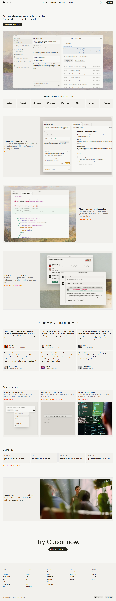

# 🚀 Cursor Landing Page Project

## Modern Developer Tool Landing Page UI

This project is a clean and modern landing page design inspired by the Cursor AI development tool.

It is built using simple HTML & CSS, focusing on layout structure, clean UI, and responsive design.

## 📌 About This Project

This is a frontend UI project created to practice:
- Clean section structuring
- Modern landing page layout
- Typography & spacing
- Developer-focused design styling
It is not the official Cursor tool, but a custom-built landing page concept designed by me.

## 🛠 Technologies Used

- HTML5
- CSS3
- Clean Folder Structure

##📂 Project Structure

CURSOR LANDING PAGE
│
├── assets/        → Images & resources
├── style.css      → Styling file
├── index.html     → Main landing page file
└── README.md      → Project documentation

## 🎯 Features

- Modern hero section
- Developer-focused content blocks
- Clean typography
- Minimal and distraction-free UI
- Organized file structure

## 🚀 How to Use

Step 1: Download or Clone
git clone https://github.com/asifansari84/cursor-landing-page.git

Step 2:

Open index.html in your browser.

## 💡 Purpose of This Project

This project was built to:
- Practice frontend layout skills
- Improve UI structuring
- Create clean developer-style landing pages
- Showcase design implementation ability

## 🙌 Thank You

Thank you for checking out this project.

This landing page reflects my frontend development skills, attention to clean design, and structured layout building.

If you like this project, feel free to ⭐ the repository and share your feedback.

## Happy Coding! 🚀